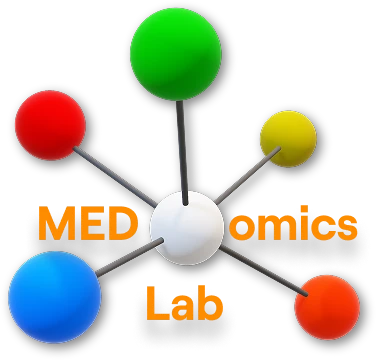
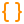

<!--suppress HtmlDeprecatedAttribute -->
<div align="center">
   <p align="center">
      <br>
      <a href="https://medomicslab.com/">
         
      </a>
   </p>
   <h4 align="center">
      Official MEDomicsLab's Website.
      <br>
      <a href="https://medomicslab.com/">Live site</a>
   </h4>
</div>

<div align="center">

<a href="https://medomicslab.com/">
   
</a>


</div>

## <a id="how-to-add-content-user-friendly"></a> How To Add Content (User-Friendly)

> [!TIP]
> This is the simple, no-code way to add or update lab content. Choose the matching form at [**Issues → New issue**](https://github.com/simonprovost/medomicslab/issues/new/choose), fill it in, and submit it. The automation validates your details and opens a draft pull request for a maintainer to review and merge—no local setup required.

<details>
<summary><strong>&nbsp;&nbsp;Add a team member</strong></summary>

<br>

Use the `Add a new team member` template.

What you'll need before opening the issue:

- A square portrait photo, **at least 512×512 pixels**, JPG or PNG. Drag it into the _Portrait photo_ field, or paste a public URL.
- A URL slug like `firstname-lastname`, lowercase, hyphenated. This becomes `/team/<slug>` on the site.
- The cohort the person belongs to. Free text, but check [`src/data/team.json`](./src/data/team.json) first to keep cohort names consistent (`Current`, `Past members`, `Lab Principal Investigator`, etc.).

The automation will:

1. Download the portrait you uploaded.
2. Generate the 12 responsive avatar variants (80, 128, 160, 256 px in AVIF, WebP, and JPG/PNG fallback).
3. Insert the entry into the right cohort in `src/data/team.json`.
4. Open a draft PR.

If a field looks confusing, leave the placeholder text in place; the parser ignores `_No response_`.

</details>

<details>
<summary><strong>&nbsp;&nbsp;Add a publication</strong></summary>

<br>

Use the `Add a new publication` template.

A publication entry needs:

- A clear title, comma-separated authors, and the year.
- A _kind_ picked from the dropdown (`Journal Papers`, `Conference Papers`, `Preprints`, `Presentations`).
- A DOI or URL. The DOI is preferred when one exists; the site renders both.
- A short abstract. One paragraph is enough; readers click through for the full text.

The automation appends the entry to the matching year bucket in [`src/data/publications.json`](./src/data/publications.json) and writes a markdown stub under `src/content/publications/<slug>.md` for any prose you provided.

Important to recall: if the paper has lab member co-authors, write their names exactly as they appear in `src/data/team.json` so the cross-link to their profile page works.

</details>

<details>
<summary><strong>&nbsp;&nbsp;Add an event</strong></summary>

<br>

Use the `Add an event` template.

Cover at minimum:

- Title (e.g. `Thesis Defense: ...`).
- Slug, usually prefixed with the date (`2026-05-15-msc-defense-x`).
- _Event kind_ from the dropdown (thesis defense, symposium, workshop, talk, lab meeting, outreach, other).
- Start date in ISO format (`YYYY-MM-DD`). End date only for multi-day events.
- Location, even if it is just `Online` or a Zoom link.
- Contributors / speakers, comma-separated, lab spelling.

Only the title, slug and contributors live in [`src/data/events.json`](./src/data/events.json); everything else (kind, dates, time, location, registration link, full description) goes into the generated markdown file at `src/content/community/events/<slug>.md`. That markdown supports HTML and `<dome-gallery album="...">` embeds.

</details>

<details>
<summary><strong>&nbsp;&nbsp;Add a news post</strong></summary>

<br>

Use the `Add a news post` template.

You'll need:

- A one-sentence headline.
- A slug prefixed with the publish date (`2026-04-24-symposium-recap`).
- The publish date in ISO format. This decides the year and month grouping on `/community/news`.
- Comma-separated contributors. Lab spelling, again.
- A markdown body. The listing card shows the title only, so the opening paragraph here is what readers see first when they click through.

The automation adds the entry to [`src/data/news.json`](./src/data/news.json) and writes the body to `src/content/community/news/<slug>.md`.

Important to recall: drag and drop images straight into the issue form. They become GitHub user attachments; the maintainer can move them under `public/images/` during review.

</details>

<details>
<summary><strong>&nbsp;&nbsp;What if I made a typo?</strong></summary>

<br>

Edit the issue. The workflow re-runs on every edit and updates (or replaces) the draft PR. If validation fails, the bot leaves a comment listing the schema errors and labels the issue `needs-changes`. Fix, save, the comment goes away, the PR appears.

</details>

<details>
<summary><strong>&nbsp;&nbsp;For Developers: Edit Data JSON</strong></summary>

<br>

This is for maintainers and anyone who has cloned the repository locally. Every page on the site reads from a JSON file (sometimes plus markdown). Edit the JSON, run `npm run check`, push.

<details>
<summary><strong>&nbsp;&nbsp;Team: <code>src/data/team.json</code></strong></summary>

<br>

- **Schema:** [`src/data/_schemas/team.schema.json`](./src/data/_schemas/team.schema.json)
- **Page:** `TeamPage`, `TeamMemberDetailPage`
- **Avatars:** 12 variants per member under `public/images/team/<slug>/avatar-{80,128,160,256}.{avif,webp,jpg|png}`. Generate them with `sharp` or use the issue automation.

Top-level array of cohorts. Each cohort has a `year` (the cohort label, not a date) and a `members` array. Each member needs `name`, `slug`, `position`, `image` (path to the 256 base file). Socials, education, and biography are optional.

After editing run:

```bash
npm run lint:schemas    # validates JSON
npm run lint:avatars    # checks the 12-file matrix per slug
```

</details>

<details>
<summary><strong>&nbsp;&nbsp;Publications: <code>src/data/publications.json</code></strong></summary>

<br>

- **Schema:** [`src/data/_schemas/publications.schema.json`](./src/data/_schemas/publications.schema.json)
- **Template:** [`src/content/_templates/publication.md`](./src/content/_templates/publication.md)
- **Pages:** `PublicationsPage`, `PublicationDetailPage`, `HomePage` (recent papers section).

Top-level array grouped by `year` (string). Each item has a stable `slug` that owns the `/publications/<slug>` URL, a `contributors` array (matches the shape used by news/events), and a `type` enum.

</details>

<details>
<summary><strong>&nbsp;&nbsp;News: <code>src/data/news.json</code></strong></summary>

<br>

- **Schema:** [`src/data/_schemas/news.schema.json`](./src/data/_schemas/news.schema.json)
- **Template:** [`src/content/_templates/news.md`](./src/content/_templates/news.md)
- **Pages:** `CommunityListPage` (`/community/news`), `CommunityItemDetailPage`.

Year → months → items. Each item references a markdown file under `src/content/community/news/`.

</details>

<details>
<summary><strong>&nbsp;&nbsp;Events: <code>src/data/events.json</code></strong></summary>

<br>

- **Schema:** [`src/data/_schemas/events.schema.json`](./src/data/_schemas/events.schema.json)
- **Template:** [`src/content/_templates/event.md`](./src/content/_templates/event.md)
- **Pages:** `CommunityListPage` (`/community/events`), `CommunityItemDetailPage`.

Same shape as news. The kind, dates, time, location, and registration link live in the markdown frontmatter / body, not in the JSON.

</details>

<details>
<summary><strong>&nbsp;&nbsp;Research projects & tracks</strong></summary>

<br>

- **Projects:** [`src/data/research-projects.json`](./src/data/research-projects.json) ([schema](./src/data/_schemas/research-projects.schema.json))
- **Tracks:** [`src/data/research-tracks.json`](./src/data/research-tracks.json) ([schema](./src/data/_schemas/research-tracks.schema.json))

A research project belongs to one or more tracks. Tracks are defined as a flat object keyed by track name; projects reference tracks by that key.

</details>

<details>
<summary><strong>&nbsp;&nbsp;Courses: <code>src/data/courses.json</code></strong></summary>

<br>

- **Schema:** [`src/data/_schemas/courses.schema.json`](./src/data/_schemas/courses.schema.json)
- **Template:** [`src/content/_templates/course.md`](./src/content/_templates/course.md)
- **Page:** `CoursesPage`, `CourseDetailPage`.

Each course has a `slug`, `title`, `summary`, instructor list, and optional links to syllabus / official course page.

</details>

<details>
<summary><strong>&nbsp;&nbsp;Homepage: <code>src/data/home.json</code></strong></summary>

<br>

- **Schema:** [`src/data/_schemas/home.schema.json`](./src/data/_schemas/home.schema.json)
- **Page:** `HomePage`.

The hero block (label, title, subtitle, CTA), the "What we do" cards, the "Open-source" featured projects, and the "Latest news / Recent papers" feed configuration. To change the homepage copy or the featured project list, edit this file. The recent papers and news sections automatically pull from `publications.json` and `news.json` (most recent N).

</details>

<details>
<summary><strong>&nbsp;&nbsp;Visions: <code>src/data/visions.json</code></strong></summary>

<br>

- **Schema:** [`src/data/_schemas/visions.schema.json`](./src/data/_schemas/visions.schema.json)
- **Page:** `VisionsPage`.

The hero, the narrative blocks (each a heading, body, optional image), and the embedded gallery references. Image paths are relative to `public/`.

</details>

<details>
<summary><strong>&nbsp;&nbsp;Layout & navigation: <code>src/data/layout.json</code></strong></summary>

<br>

- **Schema:** [`src/data/_schemas/layout.schema.json`](./src/data/_schemas/layout.schema.json)

Navbar items, footer columns, contact block, social links. Adding or reordering a top-level page only needs an edit here plus a route registration in `src/App.jsx`.

</details>

<details>
<summary><strong>&nbsp;&nbsp;Theme: <code>src/data/theme.json</code></strong></summary>

<br>

- **Schema:** [`src/data/_schemas/theme.schema.json`](./src/data/_schemas/theme.schema.json)

CSS custom properties consumed by Tailwind v4 and the design tokens. The brand orange used throughout the site (and on these badges) is `oklch(0.7505 0.1791 58.28)` ≈ `#FF8C00`. Change `--primary` here to retheme the entire site.

</details>

</details>

## <a id="running-the-site-locally"></a> Running the Site Locally

```bash
node --version       # Node 20.x is the target. Anything older is unsupported.
git clone git@github.com:simonprovost/medomicslab.git
cd medomicslab
npm install
npm run dev          # vite dev server, http://localhost:5173
npm run build        # production build to dist/
npm run preview      # serve built dist/
```

<details>
<summary><strong>&nbsp;&nbsp;Quality gates</strong></summary>

<br>

```bash
npm run check        # ESLint, Prettier, markdownlint, knip, schemas, internal links, licences
npm run check:full   # everything in `check` plus production build, size-limit, and full link crawl
npm run lhci         # Lighthouse CI audit of performance, accessibility, best practices, and SEO
```

</details>

<details>
<summary><strong>&nbsp;&nbsp;Tests</strong></summary>

<br>

```bash
npm run test:scripts     # Node test runner over `.github/scripts/__tests__/` (issue-to-PR handlers)
npm run test:e2e         # Full Playwright suite: smoke checks and SEO metadata regression tests
npm run test:seo         # Playwright check for titles, descriptions, canonical URLs, social tags, and JSON-LD
npm run test:a11y        # axe-core accessibility checks on every top-level route
npm run test:e2e:install # one-off: install the Chromium browser Playwright needs
```

</details>

<details>
<summary><strong>&nbsp;&nbsp;SEO &amp; discovery</strong></summary>

<br>

The site uses `react-helmet-async` to set a unique title, description, canonical URL, Open Graph / Twitter metadata, and JSON-LD structured data for every route. Metadata for research projects, publications, team profiles, news, events, and courses is derived from the corresponding data file.

Every production build uses `vite-plugin-sitemap` to generate `dist/sitemap.xml` and `dist/robots.txt`. The sitemap includes static routes and every content-detail route discovered from the JSON data. The canonical production hostname is configured in [`vite.config.js`](./vite.config.js); update it if the domain changes.

Run `npm run test:seo` after changing routing, SEO metadata, or content URL structures. Run `npm run build` to inspect the generated sitemap and robots files locally.

</details>

## <a id="license"></a> License

`medomicslab` is released under the [MIT License](./LICENSE). Maintained by the [MEDomicsLab](https://medomicslab.com/) at McGill University and the Université de Sherbrooke.
